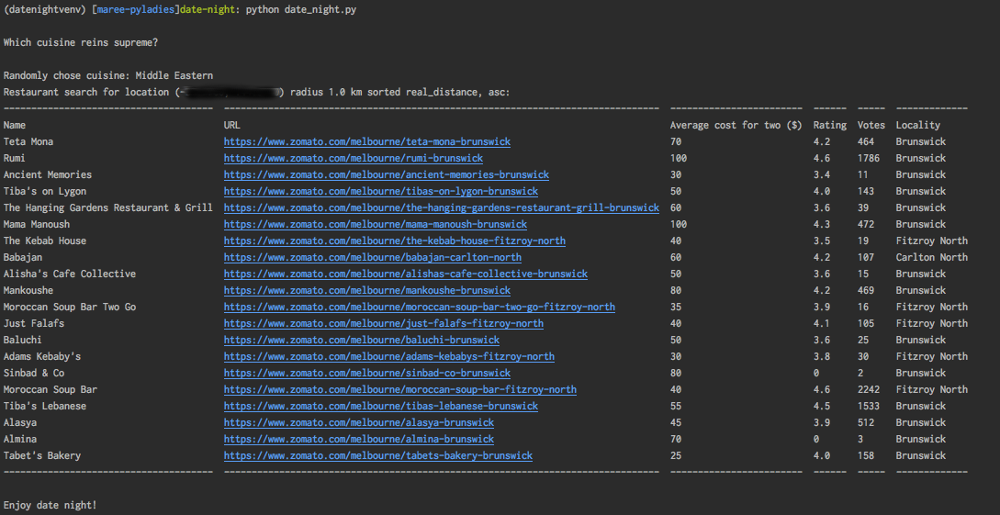

# date-night

:sushi: :bento: :spaghetti: :hamburger: :pizza: :ramen:

Can't decide which restaurant to go to for date night? This python script picks 
a random cuisine and provides restaurant suggestions near you, to save on the 
indecision and arguments!

:sushi: :bento: :spaghetti: :hamburger: :pizza: :ramen:

## Setup

### Clone the repo

```shell
git clone https://github.com/mareecarroll/date-night.git
```

### Create virtualenv

```shell
cd date-night
python3 -m venv datenightenv
source datenightenv/bin/activate
pip install -r requirements.txt
```

### Create a .cfg file to hold your settings

Settings are stored in the file `.cfg` which looks like this:
    
```ini
[all]
lat = <your latitude>
lon = <your longitude>
zomato_api_key = <your zomato api key>
radius_metres = <radius from lat lon in metres e.g. 1000>
sort_by = real_distance
sort_direction = asc
```

```shell
mv sample.cfg .cfg
```

### Get a zomato API key

Visit https://developers.zomato.com/api and click on `Request an API key`.

Edit `.cfg` to put the zomano API key after `zomato_api_key = `

### Set your location and search radius

Go to https://www.google.com/maps and type in your home address. Right-click on the 
marker that shows up and select `What's here` from the context menu. Copy the `lat,lon` 
decimal numbers and put the first number after `lat = ` and the second number after `lon = `

Next set the radius in _metres_ you want to search over.

e.g. if you want to search within:
 * 10 km, enter `10000`
 * 5 km, enter `5000`
 * 1 km, enter `1000`
 
Add your chosen value after `radius_metres = `.

## Run date-night

```shell
python date_night.py
```

Sample output:


## Notes about Zomato API

### Radius search appears to be broken

IMPORTANT: The Zomato API seems to be broken at the moment for restricting results to radius. You can set it to zero metres and it still comes back with many results. See [Developer documentation - Restaurant search](https://developers.zomato.com/documentation#!/restaurant/search) to try it for yourself. When I was searching for Pho (cuisine id 1020) within 1000 m (1km) of Brunswick lat, lon (sorted by rating descending) it was giving me a suggestion of a Springvale restaurant.

Because of this, while the script initially sorted by rating, it now sorts by distance from lat,lon. This can be changed in `.cfg` (see below) but while the API is broken it doesn't give some crazy results

```ini
sort_by = rating
sort_direction = desc
```
